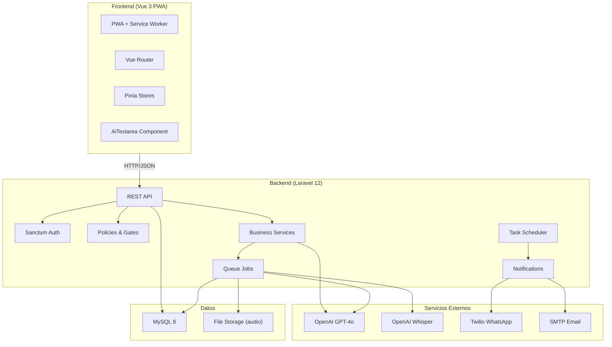

# Plan de Implementación — Sistema de Gestión Presidencia de Estaca & Sumo Consejo

---

## Resumen de Decisiones Técnicas

| Decisión | Resolución |
|---|---|
| Multiplataforma | **PWA** (Vue.js SPA instalable) |
| Proveedor IA (texto) | **OpenAI GPT-4o** |
| Proveedor IA (audio) | **OpenAI Whisper** |
| Registro de usuarios | **Enlace de invitación** único |
| Quórum de votación | **Mayoría calificada (2/3)** + fecha de cierre |
| Notificaciones | **Email + WhatsApp Bot** |
| Infraestructura | **Local** (desarrollo en máquina local por ahora) |

---

## Stack Definitivo

| Capa | Tecnología | Versión |
|---|---|---|
| Backend | Laravel | 12.x |
| Frontend | Vue.js + Vite | 3.x + 6.x |
| CSS | Tailwind CSS | 4.x |
| Base de datos | MySQL | 8.x |
| Auth | Laravel Sanctum | SPA tokens |
| Roles | Spatie Laravel Permission | 6.x |
| Colas | Laravel Queues (database driver) | built-in |
| IA Texto | OpenAI GPT-4o API | latest |
| IA Audio | OpenAI Whisper API | latest |
| Notificaciones | Laravel Notifications (Email + WhatsApp) | built-in |
| PWA | vite-plugin-pwa | latest |

---

## Estructura del Monorepo

```
sumo-consejo-estaca-la-serena/
├── docs/                          # Documentación
│   ├── srs.md                     # Especificación de requerimientos
│   └── erd.md                     # Diagrama entidad-relación
├── backend/                       # Laravel 12
│   ├── app/
│   │   ├── Models/                # Eloquent Models
│   │   ├── Http/
│   │   │   ├── Controllers/Api/   # API Controllers
│   │   │   ├── Requests/          # Form Requests (validación)
│   │   │   └── Resources/         # API Resources (transformación)
│   │   ├── Services/              # Lógica de negocio
│   │   │   ├── Ai/                # AiTextService, AiAudioService
│   │   │   ├── WhatsApp/          # WhatsAppNotificationService
│   │   │   └── Voting/            # VotingService (quórum, cierre)
│   │   ├── Jobs/                  # Async Jobs
│   │   │   ├── ProcessAudioJob.php
│   │   │   └── GenerateMinuteJob.php
│   │   ├── Notifications/         # Email + WhatsApp notifications
│   │   └── Policies/              # Authorization Policies
│   ├── database/
│   │   ├── migrations/
│   │   └── seeders/
│   ├── routes/
│   │   └── api.php
│   └── config/
│       └── services.php           # OpenAI keys, WhatsApp config
├── frontend/                      # Vue 3 SPA + PWA
│   ├── src/
│   │   ├── components/
│   │   │   ├── ai/
│   │   │   │   └── AiTextarea.vue # Componente global IA
│   │   │   ├── ui/                # Componentes UI base
│   │   │   └── layout/            # Layout components
│   │   ├── views/                 # Páginas por módulo
│   │   │   ├── auth/
│   │   │   ├── dashboard/
│   │   │   ├── assignments/
│   │   │   ├── callings/
│   │   │   ├── meetings/
│   │   │   └── reports/
│   │   ├── stores/                # Pinia stores
│   │   ├── composables/           # Vue composables
│   │   ├── router/                # Vue Router
│   │   ├── services/              # API client (axios)
│   │   └── assets/
│   ├── public/
│   │   └── manifest.json          # PWA manifest
│   └── vite.config.js
└── README.md
```

---

## Fases de Implementación

### Fase 1: Scaffolding y Base de Datos
**Duración estimada: 3-4 días**

#### [NEW] Backend — Laravel 12 Scaffolding

- Inicializar proyecto Laravel 12 en `/backend`
- Configurar `.env` con MySQL local
- Configurar CORS para comunicación con el frontend

#### [NEW] Frontend — Vue 3 + Vite + PWA

- Inicializar proyecto Vue 3 con Vite en `/frontend`
- Instalar Tailwind CSS 4, Vue Router, Pinia, Axios
- Configurar `vite-plugin-pwa` para manifest y service worker
- Configurar proxy de Vite hacia el backend

#### [NEW] Modelo de Datos — Migraciones

Crear las siguientes migraciones:

```
users                    → id, name, email, password, phone, role, avatar
invitations              → id, email, role, token, invited_by, accepted_at, expires_at
assignments              → id, title, description, created_by, assigned_to, due_date, status
stewardship_reports      → id, user_id, assignment_id, content, period_start, period_end, submitted_at
callings                 → id, proposed_by, member_name, calling_name, ward, status, voting_deadline
calling_votes            → id, calling_id, user_id, vote, voted_at
meetings                 → id, created_by, type, modality, location_or_url, platform, name, agenda, scheduled_at, status
meeting_invitations      → id, meeting_id, user_id, response, responded_at
meeting_minutes          → id, meeting_id, audio_path, transcription, agile_minute, executive_summary, processing_status
notifications_log        → id, user_id, channel, type, payload, sent_at, delivered_at
```

---

### Fase 2: Autenticación e Invitaciones
**Duración estimada: 2-3 días**

#### [NEW] `backend/app/Http/Controllers/Api/AuthController.php`
- `POST /api/login` — Login con email/password, devuelve Sanctum token
- `POST /api/logout` — Revoca token
- `GET /api/user` — Perfil del usuario autenticado

#### [NEW] `backend/app/Http/Controllers/Api/InvitationController.php`
- `POST /api/invitations` — (Solo Presidencia) Genera enlace único con token + rol asignado
- `GET /api/invitations/{token}` — Valida token, muestra formulario de registro
- `POST /api/invitations/{token}/accept` — Crea usuario con el rol definido en la invitación

#### [NEW] `frontend/src/views/auth/LoginView.vue`
- Formulario de login con diseño premium
- Persistencia de sesión con Sanctum cookies/tokens

#### [NEW] `frontend/src/views/auth/AcceptInvitationView.vue`
- Página para aceptar invitación y crear cuenta
- Validación de token expirado

#### [NEW] Guards y middleware
- `auth:sanctum` middleware en rutas protegidas
- Vue Router guards para redirección por rol
- Middleware `role:presidencia` para rutas administrativas

---

### Fase 3: Módulo de Mayordomías y Asignaciones
**Duración estimada: 4-5 días**

#### [NEW] `backend/app/Http/Controllers/Api/AssignmentController.php`
- CRUD completo de asignaciones (solo Presidencia crea)
- Filtros por estado, asignado, fechas

#### [NEW] `backend/app/Http/Controllers/Api/StewardshipReportController.php`
- `POST /api/reports` — Sumo Consejo envía informe
- `GET /api/reports` — Presidencia ve todos los informes
- `GET /api/reports/pending` — Informes pendientes del periodo actual

#### [NEW] `backend/app/Console/Commands/RequestStewardshipReport.php`
- Comando schedulado cada 15 días
- Envía notificación (Email + WhatsApp) a cada miembro del Sumo Consejo
- Registra en `notifications_log`

#### [NEW] `frontend/src/components/ai/AiTextarea.vue`
- Componente Vue reutilizable con botón "✨ Mejorar redacción"
- Envía texto a `POST /api/ai/improve-text`
- Muestra preview del texto mejorado con diff visual
- Botones "Aceptar" / "Descartar"

#### [NEW] `backend/app/Services/Ai/AiTextService.php`
- Integración con OpenAI GPT-4o
- System prompt especializado en normas RAE
- Rate limiting por usuario

---

### Fase 4: Módulo de Aprobación de Llamamientos
**Duración estimada: 3-4 días**

#### [NEW] `backend/app/Http/Controllers/Api/CallingController.php`
- `POST /api/callings` — (Solo Secretario) Crea propuesta con **fecha de cierre de votación**
- `GET /api/callings` — Lista llamamientos con estado y conteo de votos
- `GET /api/callings/{id}` — Detalle con votos individuales (solo Presidencia/Secretario)
- `POST /api/callings/{id}/vote` — Emitir voto (solo antes de fecha de cierre)

#### [NEW] `backend/app/Services/Voting/VotingService.php`
- Calcula quórum: **2/3 de votos a favor** para aprobar
- Valida que la votación no haya cerrado (fecha de cierre)
- Cierre automático al llegar la fecha límite (vía scheduled command)
- Tabulación en tiempo real del estado de votación

#### [NEW] `backend/app/Console/Commands/CloseExpiredVotings.php`
- Comando schedulado cada hora
- Cierra votaciones cuya `voting_deadline` haya pasado
- Calcula resultado final y actualiza estado
- Notifica resultado a Presidencia y Secretario

#### [NEW] `frontend/src/views/callings/CallingListView.vue`
- Lista de llamamientos con badges de estado (Abierta, Aprobada, Rechazada)
- Countdown timer hasta fecha de cierre
- Barra de progreso de votos emitidos vs. pendientes

#### [NEW] `frontend/src/views/callings/CallingVoteView.vue`
- Detalle del llamamiento con información del candidato
- Botones Aprobar / Desaprobar con confirmación
- Indicador de voto ya emitido

---

### Fase 5: Módulo de Reuniones + IA Audio
**Duración estimada: 5-7 días**

#### [NEW] `backend/app/Http/Controllers/Api/MeetingController.php`
- CRUD de reuniones con tipo y modalidad
- `POST /api/meetings/{id}/invite` — Envía invitaciones con RSVP
- `PATCH /api/meetings/{id}/rsvp` — Responder asistencia
- `POST /api/meetings/{id}/upload-audio` — Sube audio y dispara Job

#### [NEW] `backend/app/Jobs/ProcessAudioJob.php`
- Recibe audio y lo envía a **OpenAI Whisper API**
- Genera transcripción completa
- Almacena resultado en `meeting_minutes.transcription`

#### [NEW] `backend/app/Jobs/GenerateMinuteJob.php`
- Se ejecuta después de `ProcessAudioJob` (job chaining)
- Envía transcripción + agenda + lista de asistentes a **GPT-4o**
- Prompt estructurado para generar JSON con:
  1. Resumen ejecutivo
  2. Puntos clave discutidos
  3. Decisiones tomadas
  4. Matriz de acciones (tarea, responsable, plazo)
  5. Asuntos pendientes
- Actualiza estado a "Procesada"
- Notifica a Presidencia vía Email + WhatsApp

#### [NEW] `backend/app/Services/Ai/AiAudioService.php`
- Wrapper para OpenAI Whisper API
- Manejo de archivos grandes (chunking si > 25MB)
- Retry logic con backoff exponencial

#### [NEW] `frontend/src/views/meetings/MeetingDetailView.vue`
- Vista de reunión con tabs: Agenda | Asistentes | Minuta
- Upload de audio con progress bar
- Estado de procesamiento en tiempo real (polling)
- Visualización de minuta ágil con secciones colapsables

#### [NEW] `frontend/src/views/meetings/MeetingCreateView.vue`
- Formulario de creación con toggle Presencial/Videoconferencia
- Campos dinámicos según modalidad
- Selector de miembros a invitar
- AiTextarea en campo de agenda

---

### Fase 6: Notificaciones Email + WhatsApp
**Duración estimada: 2-3 días**

#### [NEW] `backend/app/Services/WhatsApp/WhatsAppService.php`
- Integración con **Twilio WhatsApp API** (o alternativa como Meta Cloud API)
- Templates para cada tipo de notificación
- Cola de envío con retry

#### [NEW] Notifications Laravel
- `StewardshipReportRequested` — Email + WhatsApp
- `NewCallingProposed` — Email + WhatsApp
- `MeetingInvitation` — Email + WhatsApp con botón RSVP
- `MinuteReady` — Email + WhatsApp
- `VotingClosed` — Email + WhatsApp con resultado

> [!NOTE]
> Para WhatsApp en desarrollo local, se puede usar el **Sandbox de Twilio** o **Mock** hasta definir infraestructura de producción.

---

## Diagrama de Arquitectura



---

## Verificación

### Automated Tests
```bash
# Backend
cd backend && php artisan test

# Tests unitarios para servicios
php artisan test --filter=AiTextServiceTest
php artisan test --filter=VotingServiceTest
php artisan test --filter=ProcessAudioJobTest

# Frontend
cd frontend && npm run test
```

### Manual
- Login con enlace de invitación
- Crear asignación y verificar notificación
- Crear llamamiento, votar y verificar cierre automático por fecha
- Crear reunión, subir audio de prueba y verificar generación de minuta
- Probar `AiTextarea` con texto con errores ortográficos
- Instalar como PWA en móvil y verificar funcionamiento

---

## Estimación Total

| Fase | Días estimados |
|---|---|
| 1. Scaffolding y BD | 3-4 |
| 2. Auth e Invitaciones | 2-3 |
| 3. Mayordomías y Asignaciones | 4-5 |
| 4. Llamamientos y Votación | 3-4 |
| 5. Reuniones + IA Audio | 5-7 |
| 6. Notificaciones | 2-3 |
| **Total** | **19-26 días** |

> [!IMPORTANT]
> La estimación asume desarrollo individual a tiempo completo. La Fase 5 (IA Audio) es la más compleja y podría extenderse si hay problemas con la calidad de diarización de Whisper.
