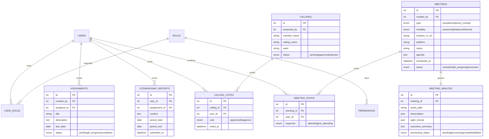

# Análisis del SRS — Sistema de Gestión Presidencia de Estaca & Sumo Consejo

---

## 1. Evaluación General

| Aspecto | Valoración | Comentario |
|---|---|---|
| Claridad de objetivos | 🟢 Alta | El propósito del sistema está bien definido |
| Alcance funcional | 🟢 Bien delimitado | 4 módulos core + 2 servicios IA |
| Stack tecnológico | 🟡 Con observaciones | Algunas decisiones necesitan validación |
| Especificación de datos | 🔴 Ausente | No hay modelo de datos ni ERD |
| Seguridad y autenticación | 🔴 Ausente | No se menciona auth, sesiones ni permisos granulares |
| NFRs (No funcionales) | 🔴 Ausente | Sin métricas de rendimiento, SLAs ni escalabilidad |
| UX/UI | 🟡 Parcial | Solo se menciona responsivo + Tailwind, sin wireframes |
| Pruebas y QA | 🔴 Ausente | Sin estrategia de testing |
| Despliegue e infraestructura | 🔴 Ausente | Sin definición de hosting, CI/CD ni entornos |

---

## 2. Fortalezas del Documento

- **Módulos bien segmentados**: Mayordomías, Llamamientos, Reuniones y IA están claramente separados por responsabilidad.
- **Flujo asíncrono bien concebido**: El uso de Laravel Jobs para procesamiento de audio es la decisión correcta.
- **Diferenciador IA claro**: Los dos servicios de IA (redacción RAE y minutas ágiles) están bien descritos con inputs/outputs esperados.
- **Componente reutilizable**: La idea de `AiTextarea.vue` como componente global es acertada para DRY.

---

## 3. Observaciones Críticas y Gaps

### 3.1. Stack Tecnológico

> [!WARNING]
> **Laravel 13 no existe.** La última versión estable es **Laravel 12** (lanzada en febrero 2025). Se debe corregir a Laravel 12.x o especificar "última versión estable al momento del desarrollo".

> [!IMPORTANT]
> **Falta definición del proveedor de IA.** El SRS menciona "LLM" genéricamente pero no especifica:
> - ¿Qué API? (OpenAI GPT-4o, Claude, Gemini, modelo local)
> - ¿Qué servicio de diarización de audio? (Whisper + pyannote, AssemblyAI, Google Speech-to-Text)
> - Costos estimados por procesamiento
> - Fallback si la API falla

| Decisión pendiente | Opciones sugeridas |
|---|---|
| LLM para redacción RAE | OpenAI GPT-4o / Claude Sonnet / Gemini 2.5 Flash |
| Transcripción de audio | OpenAI Whisper API / AssemblyAI / Google STT |
| Diarización (quién habla) | AssemblyAI (incluida) / pyannote.audio (self-hosted) |
| Almacenamiento de audio | S3/DigitalOcean Spaces / almacenamiento local |

---

### 3.2. Modelo de Datos (Ausente)

El SRS no define entidades ni relaciones. Propongo el siguiente modelo implícito extraído del documento:

---

### 3.3. Autenticación y Seguridad (Ausente)

El SRS no menciona cómo se autenticarán los usuarios. Puntos a definir:

| Aspecto | Pregunta abierta |
|---|---|
| **Autenticación** | ¿Laravel Sanctum (SPA) o Passport (OAuth2)? |
| **Registro** | ¿Los usuarios se registran o son invitados por la Presidencia? |
| **Protección de datos** | ¿Se requiere cifrado de datos sensibles (votos, informes)? |
| **Auditoría** | ¿Se necesita log de acciones (quién votó qué, cuándo)? |
| **Sesiones** | ¿Timeout de sesión? ¿Refresh tokens? |

> [!IMPORTANT]
> Dado que el sistema maneja **votos individuales** y **datos de personas en llamamientos**, es imprescindible definir políticas de privacidad y control de acceso granular.

---

### 3.4. Notificaciones (Subexplorado)

El SRS menciona notificaciones en varios puntos pero no las consolida:

| Evento | Canal sugerido | Destinatario |
|---|---|---|
| Solicitud de informe quincenal | Push + Email | Sumo Consejo |
| Nuevo llamamiento para votar | Push + Email | Sumo Consejo |
| Convocatoria de reunión (RSVP) | Push + Email | Miembros invitados |
| Minuta ágil lista | Push + Email | Presidencia |
| Recordatorio de informe pendiente | Push | Sumo Consejo |

> [!NOTE]
> **¿Push cómo?** El SRS menciona "Push o Email" pero no define si es:
> - Push web (Service Workers / Web Push API)
> - Push nativo (requiere app nativa o wrapper como Capacitor/Ionic)
> - WhatsApp/Telegram Bot (alternativa ligera)

---

### 3.5. "Multiplataforma" sin definición

El SRS dice "aplicación multiplataforma (móvil, tablet, escritorio)" pero el stack solo incluye **Vue.js SPA**. Esto implica dos caminos posibles:

| Opción | Enfoque | Pros | Contras |
|---|---|---|---|
| **A: PWA** | Vue.js SPA como Progressive Web App | Un solo codebase, instalable, offline básico | Sin acceso a Push nativo real, limitado en iOS |
| **B: Híbrida** | Vue.js + Capacitor/Ionic | Acceso a APIs nativas, store deployment | Mayor complejidad, builds adicionales |
| **C: Solo responsive** | Vue.js SPA responsive | Más simple, sin instalación | No es realmente "app", sin offline |

> [!IMPORTANT]
> Se debe definir qué significa "multiplataforma" en este contexto. **Recomendación:** PWA (opción A) por balance costo/beneficio.

---

### 3.6. Aspectos No Funcionales Ausentes

| Requisito No Funcional | Qué definir |
|---|---|
| **Rendimiento** | Tiempo máximo de respuesta API (ej. < 200ms), tiempo de procesamiento de audio |
| **Disponibilidad** | SLA esperado (ej. 99.5%) |
| **Escalabilidad** | ¿Cuántos usuarios concurrentes? (probablemente < 20, simplifica decisiones) |
| **Almacenamiento** | Tamaño máximo de audio, retención de datos, política de respaldo |
| **Internacionalización** | ¿Solo español? ¿Futuro multilingüe? |
| **Accesibilidad** | ¿Se requiere cumplimiento WCAG? |

---

### 3.7. Preguntas de Negocio sin Resolver

1. **Quórum de votación**: ¿Cuántos votos se necesitan para aprobar un llamamiento? ¿Mayoría simple, unanimidad, porcentaje mínimo?
2. **Informes quinecenales**: ¿Qué pasa si un miembro no envía su informe? ¿Escalamiento automático?
3. **Edición de minutas**: ¿La minuta generada por IA es final o puede editarse manualmente antes de publicar?
4. **Historial**: ¿Se mantiene historial de asignaciones y reuniones pasadas? ¿Por cuánto tiempo?
5. **Rotación de roles**: ¿Qué sucede cuando cambia la Presidencia o un miembro del Sumo Consejo?
6. **Reuniones recurrentes**: ¿Se pueden programar reuniones recurrentes (ej. cada primer domingo)?

---

## 4. Recomendaciones para el SRS

### Secciones a agregar

| # | Sección faltante | Prioridad |
|---|---|---|
| 1 | **Modelo de datos / ERD** | 🔴 Alta |
| 2 | **Autenticación y autorización** | 🔴 Alta |
| 3 | **Proveedor(es) de IA específicos** | 🔴 Alta |
| 4 | **Sistema de notificaciones** | 🟡 Media |
| 5 | **Requisitos no funcionales** | 🟡 Media |
| 6 | **Wireframes o mockups** | 🟡 Media |
| 7 | **Plan de despliegue** | 🟡 Media |
| 8 | **Estrategia de testing** | 🟡 Media |
| 9 | **Definición de "multiplataforma"** | 🟡 Media |
| 10 | **Reglas de negocio (quórum, escalamiento)** | 🟡 Media |

### Correcciones inmediatas

1. ~~Laravel 13~~ → **Laravel 12** (o "última versión estable")
2. Especificar si la SPA usa **Sanctum** para autenticación
3. Definir el proveedor de LLM y servicio de audio concretos

---

## 5. Estimación de Complejidad por Módulo

| Módulo | Complejidad | Justificación |
|---|---|---|
| Roles y Permisos | 🟢 Baja | Pocos roles fijos, Spatie Laravel Permission |
| Mayordomías y Asignaciones | 🟡 Media | CRUD + scheduler quincenal + IA textarea |
| Aprobación de Llamamientos | 🟡 Media | Votación con tabulación real-time (WebSockets o polling) |
| Gestión de Reuniones | 🟡 Media | RSVP + agenda + múltiples modalidades |
| Asistente Redacción RAE | 🟢 Baja | Un endpoint + componente Vue reutilizable |
| Procesamiento Audio/Minutas | 🔴 Alta | Transcripción + diarización + generación estructurada + jobs asíncronos |

---

## 6. Veredicto

El SRS es un **buen punto de partida funcional** pero está incompleto como documento de especificación técnica. Cubre el **"qué"** de manera razonable pero le falta el **"cómo"**, el **"con qué"** y el **"bajo qué restricciones"**.

> [!TIP]
> **Siguiente paso recomendado:** Resolver las preguntas abiertas de las secciones 3.3 a 3.7, corregir la versión de Laravel, y definir los proveedores de IA. Con eso, el documento estará listo para iniciar el plan de implementación.
